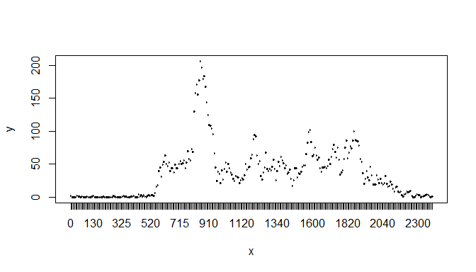
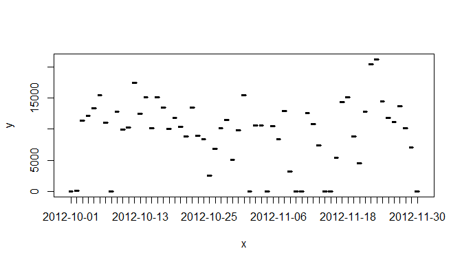
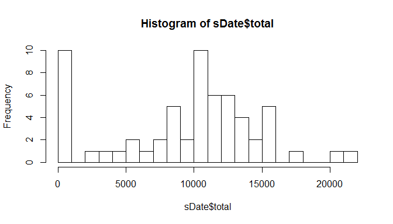
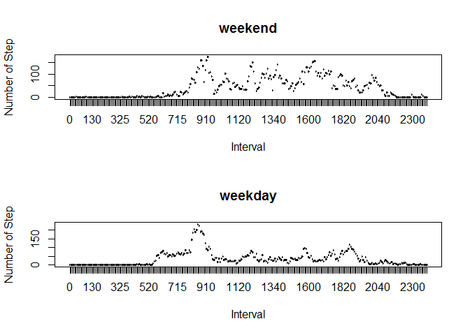

## Loading and preprocessing the data

```r
library(dplyr)
```

```
## 
## Attaching package: 'dplyr'
```

```
## The following objects are masked from 'package:stats':
## 
##     filter, lag
```

```
## The following objects are masked from 'package:base':
## 
##     intersect, setdiff, setequal, union
```

```r
dat = read.csv("activity.csv")
# dat <- filter(dat, !is.na(steps))
dat <- mutate(dat, date = factor(as.Date(date, "%Y-%m-%d")))
dat <- mutate(dat, interval = factor(interval))

gDate <- group_by(dat, date)
```

Calculate the total number of steps taken per day

```r
sDate <- summarise(gDate, total = sum(steps, na.rm = TRUE))
```

Make a histogram of the total number of steps taken each day

```r
#plot(sDate$date, sDate$total, type = "S")
hist(sDate$total, breaks = 20)
```

<!-- -->

The mean and median of the total number of steps taken per day

```r
meanDate <- mean(sDate$total)
medianDate <- median(sDate$total)
```
Mean is 

```
## [1] 9354.23
```
Median is 

```
## [1] 10395
```

## What is the average daily activity pattern?

```r
gInterval <- group_by(dat, interval)
sInterval <- summarise(gInterval, avgStep = mean(steps, na.rm = TRUE))
meanStep <- mean(sInterval$avgStep)
```

Make a time series plot of 5-min interval (x-axis)
and avg no of steps taken, avg across all days (y-axis)

```r
plot(sInterval$interval, sInterval$avgStep, type = "1")
```

<!-- -->

Which 5-minute interval, on average across all the days in the 
dataset, contains the maximum number of steps?

```r
sInterval$interval[sInterval$avgStep == max(sInterval$avgStep)]
```

```
## [1] 835
## 288 Levels: 0 5 10 15 20 25 30 35 40 45 50 55 100 105 110 115 120 125 ... 2355
```

## Imputing missing values

Calculate and report the total number of missing values in the dataset 

```r
sum(is.na(dat$steps))
```

```
## [1] 2304
```

Replace NA with mean for that 5-min interval

```r
dat = read.csv("activity.csv")
#dat = dat[200:500,]
dat <- mutate(dat, date = factor(as.Date(date, "%Y-%m-%d")))
dat <- mutate(dat, interval = factor(interval))

gDate <- group_by(dat, date)
sDate <- summarise(gDate, total = sum(steps, na.rm = TRUE))
```

histogram of the total number of steps taken each day

```r
plot(sDate$date, sDate$total, type = "S")
```

<!-- -->

```r
hist(sDate$total, breaks = 20)
```

<!-- -->

the mean and median total number of steps taken per day. 

```r
meanDate <- mean(sDate$total)
medianDate <- median(sDate$total)
```
Mean is 

```
## [1] 9354.23
```
Median is 

```
## [1] 10395
```


## Are there differences in activity patterns between weekdays and weekends?
Create a new factor variable in the dataset with two levels – 
“weekday” and “weekend” 

```r
dat <- mutate(dat, day = weekdays(as.Date(date, format = "%Y-%m-%d")))
#table(dat$day)
#dat <- mutate(dat, weekend = if (day=="Saturday") TRUE else FALSE)
#table(dat$weekend)
for (i in 1:nrow(dat)){
  if(dat[i,4] == "Saturday" | dat[i,4] == "Sunday" ){
    dat[i,4] = "weekend"
  }
  else{
    dat[i,4] = "weekday"
  }
}
dat <- mutate(dat, day = factor(day))

dat.weekday <- filter(dat, day=="weekday")
dat.weekend <- filter(dat, day=="weekend")


gInterval.weekend <- group_by(dat.weekend, interval)
sInterval.weekend <- summarise(gInterval.weekend, avgStep = mean(steps, na.rm = TRUE))
gInterval.weekday <- group_by(dat.weekday, interval)
sInterval.weekday <- summarise(gInterval.weekday, avgStep = mean(steps, na.rm = TRUE))
```
panel plot containing a time series plot of the 5-minute interval (x-axis) and the  average number of steps taken, averaged across all weekday days or weekend days (y-axis). 

```r
par(mfcol = c(2, 1))
plot(sInterval.weekend$interval, sInterval.weekend$avgStep, type = "1",
     main="weekend", xlab="Interval", ylab="Number of Step")
plot(sInterval.weekday$interval, sInterval.weekday$avgStep, type = "1",
     main="weekday", xlab="Interval", ylab="Number of Step")
```

<!-- -->


